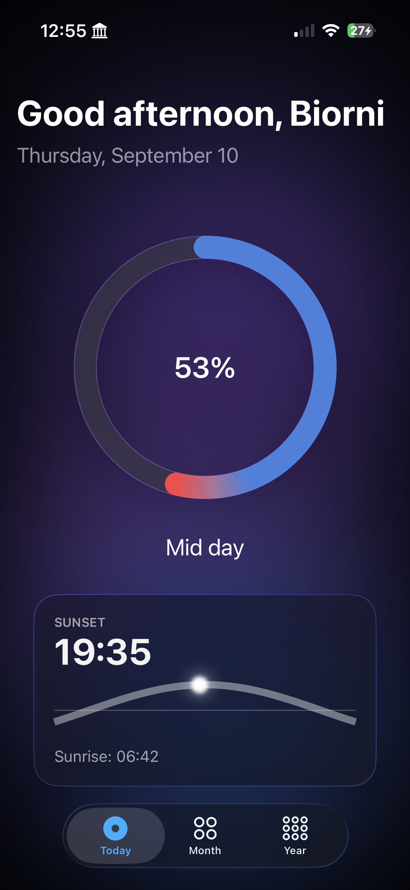
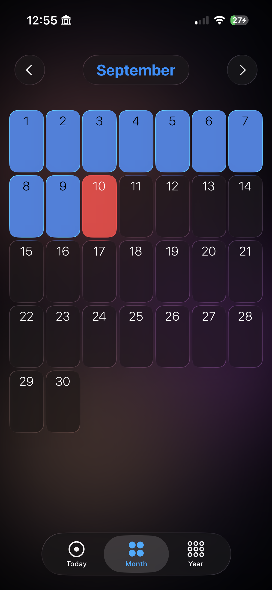
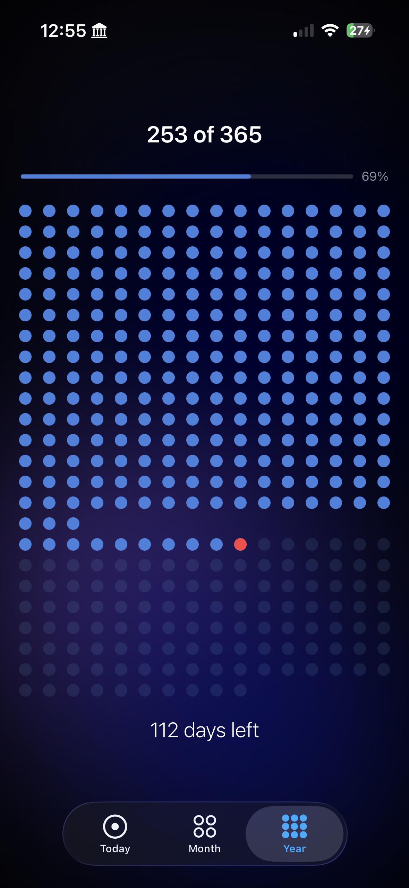
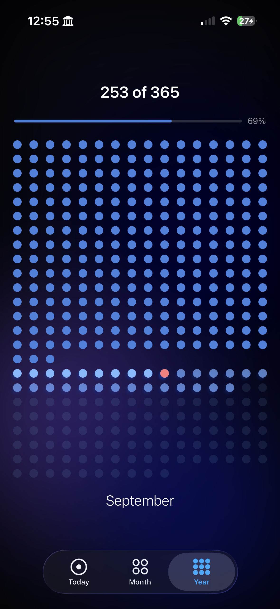

# Still Here

  
  
  
  

An iOS time-awareness app that helps you notice time passing, gently.

Built with SwiftUI. *Still Here* visualizes your day, month, and year so the
passage of time feels grounding rather than stressful — a quiet reminder to be
present and intentional with the time you have.

## Features

- **Today** — a live day-progress ring, a time-of-day greeting, and a sunrise-to-sunset
  arc showing where you are in the daylight.
- **Month** — a browsable calendar grid across all twelve months, with past days
  filled and the current day marked. Wrapped in a native Liquid Glass month picker.
- **Year** — the full year as a grid of days, with a self-forming layout that isolates
  the current month, tap-to-reveal month names, and today highlighted.
- **Notifications** — optional gentle reminders that time is passing.
- Soft, animated gradient backgrounds and a dark, calm visual identity.

## Built with

- **SwiftUI** (iOS 26)
- Liquid Glass design system (`glassEffect`, `GlassEffectContainer`)
- Custom `Shape` drawing, `TimelineView`, `AngularGradient`, and animated backgrounds

## Running it

Requires Xcode 16 or later.

1. Clone the repo
2. Open `Still Here.xcodeproj`
3. Select an iPhone simulator and press Run (⌘R)

## Author

Built by Biorni Hasmegaj as a first native iOS project, designed, built, and shipped solo.
